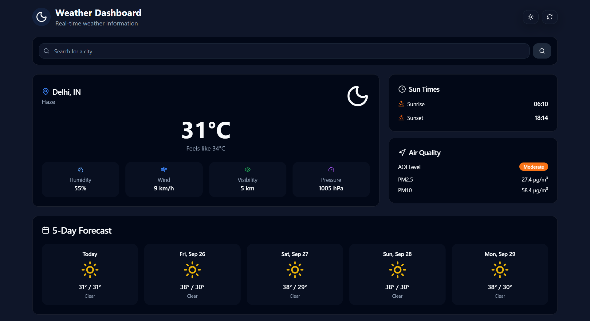

# 🌦️ Dynamic Weather Dashboard

[](https://dynamic-weather-dashboard-blue.vercel.app/)  
[](https://reactjs.org/)  
[](https://tailwindcss.com/)  
[](https://www.typescriptlang.org/)  

---

## 🌟 Overview

The **Dynamic Weather Dashboard** is a **modern, fully responsive weather application** designed to provide **real-time weather updates** with a visually appealing interface.  

Inspired by professional weather apps like **Apple Weather** and **Weather.com**, the dashboard features:

- **Glassmorphism design:** Semi-transparent cards with blur effects  
- **Dynamic backgrounds:** Sunny gradients, stormy animations, snowy effects  
- **Weather-themed color palette:** Sky blues, sunset oranges, storm grays  
- **Smooth animations & micro-interactions:** Hover effects, loading animations, transitions  

This app is **portfolio-ready** and demonstrates professional UI/UX, real-time data handling, and front-end engineering best practices.

**Live Demo:** [Check it here](https://dynamic-weather-dashboard-blue.vercel.app/)

---

## ✨ Design Vision

- **Dynamic Backgrounds:** Changes based on current weather conditions  
- **Glassmorphism Cards:** Semi-transparent panels with blur effects  
- **Weather-themed Colors:** Sky blues, sunset oranges, storm grays  
- **Smooth Micro-interactions:** Hover effects, animated icons, and transitions  

---

## 🚀 Features

### 🌤️ Real-time Weather (Homepage)
- Current temperature, humidity, wind speed, pressure, and visibility  
- Weather conditions with animated icons  
- "Feels like" temperature and descriptive details  

### 🎨 Dynamic UI/UX
- Glassmorphism cards with beautiful blur effects  
- Smooth animations and micro-interactions using CSS keyframes  
- Animated weather icons that float, pulse, or move  
- Responsive for all devices (desktop, tablet, mobile)  

### 🌓 Dark/Light Mode
- Persistent theme preference using `localStorage`  
- Smooth transitions between light and dark mode  
- Weather-appropriate styling for each mode  

### 🔍 Advanced Search & Location
- City search with real-time suggestions  
- Browser geolocation for automatic detection  
- Location caching for faster reloads  

### ⚡ Performance & User Experience
- Secure API key management in `.env`  
- Optimized API calls and caching of last searched location  
- Loading states and error handling with toast notifications  

---

## 🛠️ Tech Stack

| Layer          | Technology / Library |
|----------------|--------------------|
| Frontend       | React.js + TypeScript |
| Styling        | Tailwind CSS, Custom Animations |
| State          | React Hooks & Context API |
| API            | OpenWeatherMap API |
| Geolocation    | Browser Geolocation API |
| Deployment     | Vercel / Netlify |

---

## 🖼️ Screenshots (Homepage)

| Homepage |
|----------|
|  |

---

## ⚡ Development Process

1. **Design System & Core Components**
   - Created color palettes, glassmorphism cards, and animation utilities  
   - Developed custom Tailwind CSS classes for smooth transitions and hover effects  

2. **Theme Provider**
   - Implemented a reusable theme provider component  
   - Managed dark/light theme switching with persistent localStorage state  

3. **Weather Components**
   - Developed core weather service and types  
   - Created `WeatherIcon` and main dashboard components  
   - Integrated API key input for OpenWeatherMap  

4. **Main App & Homepage**
   - Assembled all components into `App.tsx`  
   - Optimized for responsive layout and accessibility  

5. **SEO & Metadata**
   - Updated `index.html` with meta tags and optimized title  

---

## ⚡ Installation & Setup

1. **Clone the Repository**
   ```bash
   git clone https://github.com/yourusername/weather-dashboard.git
   cd weather-dashboard
   ```

2. **Install Dependencies**
   ```bash
   npm install
   ```

3. **Add OpenWeatherMap API Key**
   - Get a free key from [OpenWeatherMap](https://openweathermap.org/api)  
   - Create `.env` in the root:
     ```env
     VITE_WEATHER_API_KEY=your_api_key_here
     ```

4. **Run Development Server**
   ```bash
   npm run dev
   ```
   Visit [http://localhost:5173](http://localhost:5173)

---

## 🚀 Deployment

- Deploy instantly using **Vercel** or **Netlify**  
- Add your API key in environment variables  
- Your live app will be accessible online

---

## 📌 Roadmap / Future Improvements

- Multi-language support 🌍  
- 5-day forecast and weekly trends 📅  
- Air Quality Index (AQI) with color-coded indicators 🌬️  
- Sunrise/Sunset times 🌅  
- PWA support for mobile installation 📱  
- Severe weather alerts & notifications 🔔  

---

## 👨‍💻 Author

**Saket Chaudhary** – Aspiring Software Engineer & AI Enthusiast  

- 🌐 [GitHub](https://github.com/Saket22-CS)  
- 💼 [LinkedIn](https://www.linkedin.com/in/saket-chaudhary22)  
- 📧 [Email](mailto:saketrishu64821@gmail.com)  

---

## 📄 License

MIT License © 2025 [Saket Chaudhary](https://github.com/Saket22-CS)
